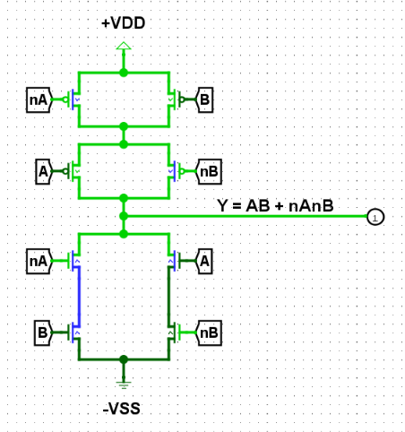
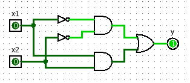
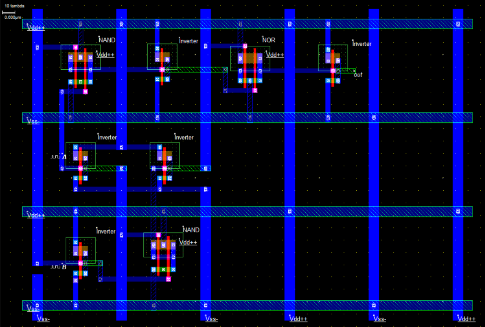
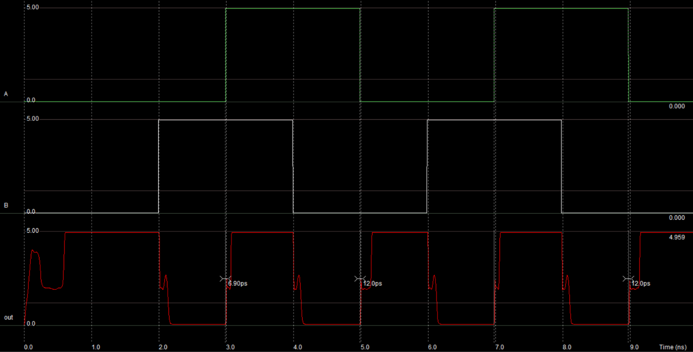

# VLSI Final Project

This repo holds the design files for our final project at ORION VLSI Technologies during our Physical Design (PD) internship there for the summer of 2026.

## More closely

An XNOR gate can be realized in many ways, but below is schematic of the realization with the smallest number of CMOS elements:

However, in order to create a unique task for each member of the team we chose to realize the XNOR gate using the schematic in the figure below:

And below is the final layout we achieved using Microwind:

And here is the simulation result where `A` and `B` are the inputs, and `out` is the output of the laid out XNOR gate:

## How to run?

We recommend using `Microwind v3.8.1`, since that's what we used.

## Usage of AI

Claude has been voluntarily used for the purpose of generating the Python-based script <code><a href="https://github.com/OdaiJ/microwind-power-grid-generator">microwind-power-grid-generator</a></code>.

## Roles

| Task | Assignee | Due Date | Time Remaining | Status |
| --- | --- | --- | --- | --- |
| Inverter | Layan Salem | Sat, Aug 29 | | Complete ✅ |
| NAND | NasirAldeen Ishtaiah | Sat, Aug 29 | | Complete ✅ |
| AND | Sadeen Faqih | Sun, Aug 30 (morning) | | Complete ✅ |
| NOR | Kareem Hamza | Sun, Aug 30 (noon) | | Complete ✅ |
| OR | Bashar Zein | Sun, Aug 30 (afternoon) | | Complete ✅ |
| Inverted Inputs AND | Lana Sayes | Sun, Aug 30 (afternoon) | | Complete ✅ |
| Power Grid | Odai AlJabari | Tue, Sep 1 (morning) | | Complete ✅ |
| Component Placement and Routing | Mohyeddin Eis | Tue, Sep 1 (morning) | | Complete ✅ |

Supervisor: Eng. Rami Malki

## Acknowledgement

We would like to thank ORION VLSI Technologies for this awesome learning experience! Yes, we didn't create any cool ASICs (yet), but we have learned and applied the basics and worked as a team!
